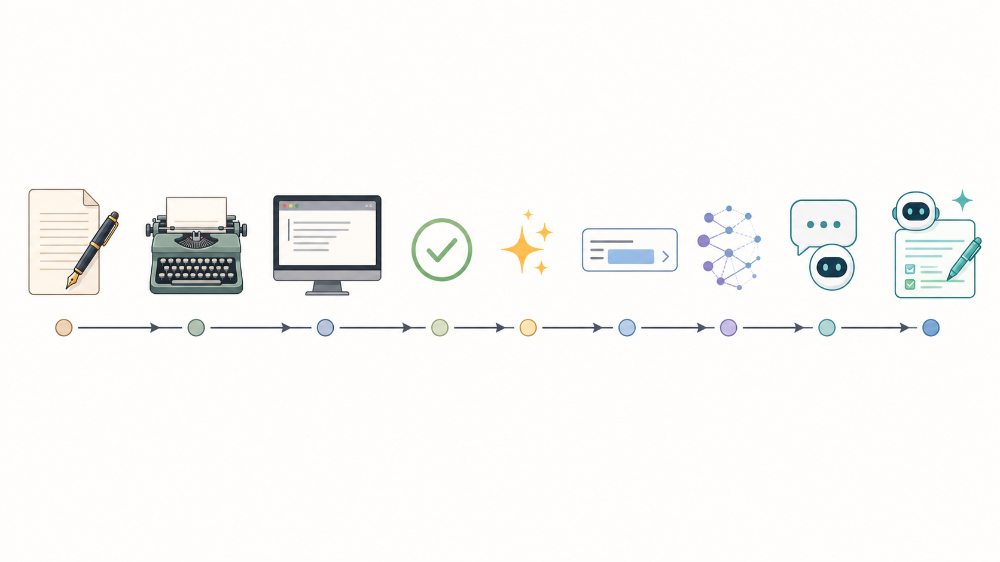
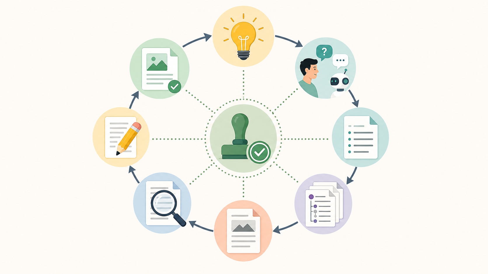
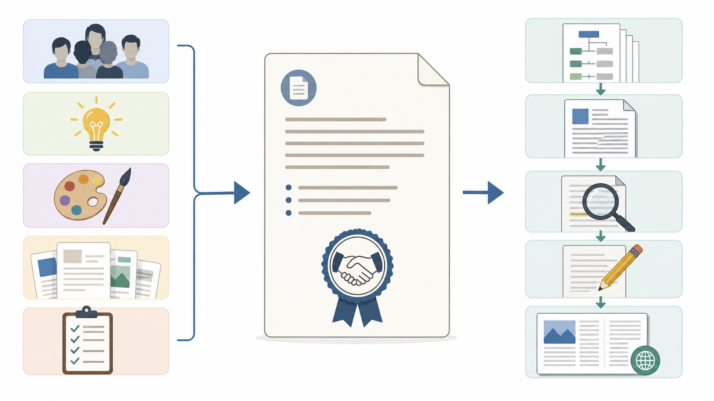
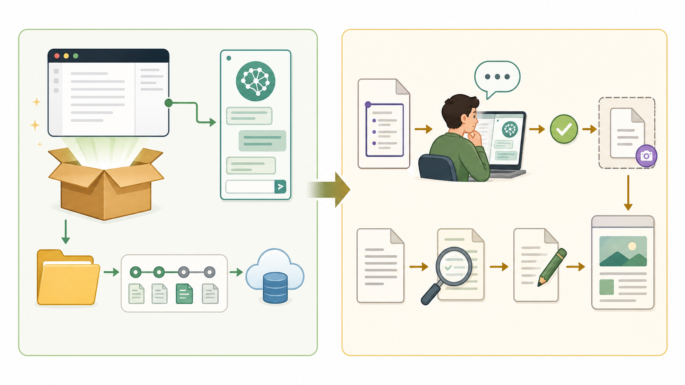
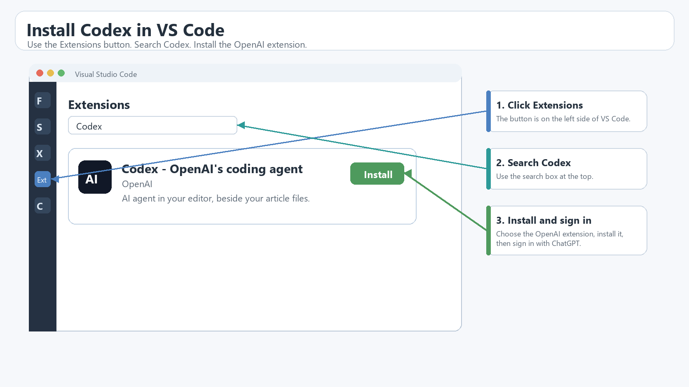
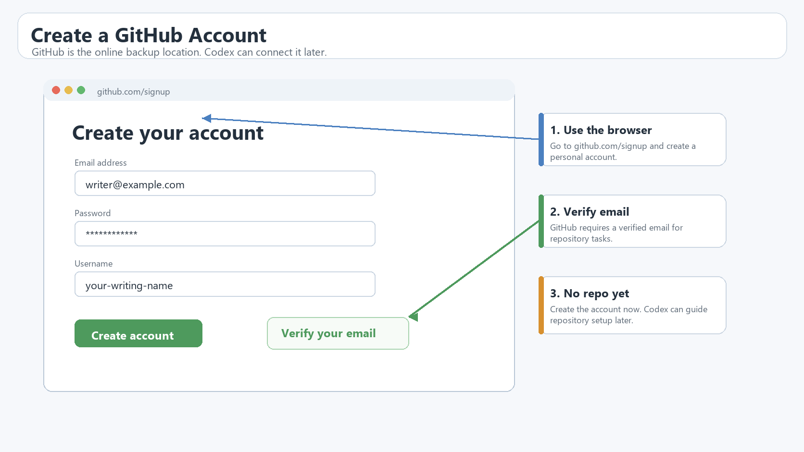
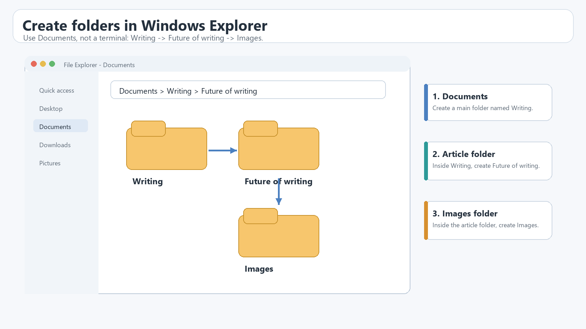
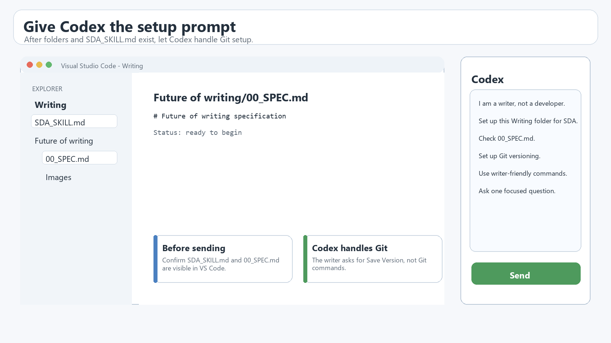
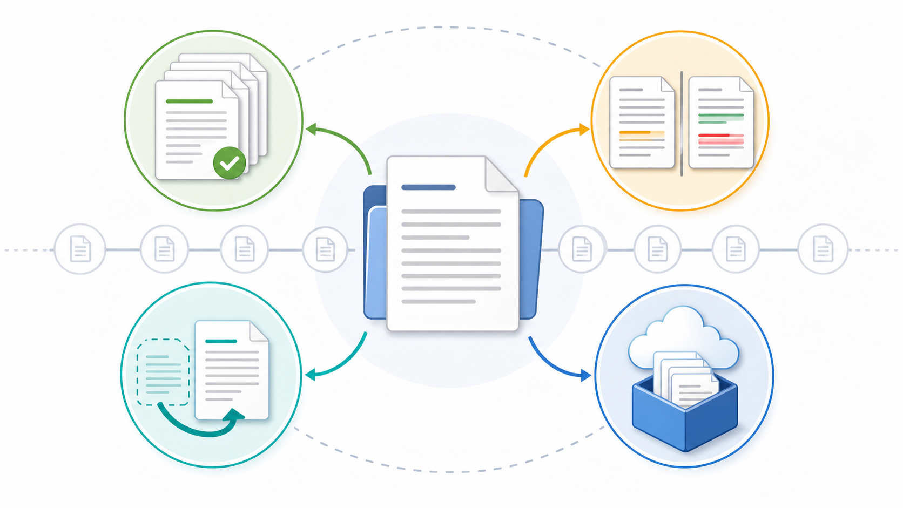
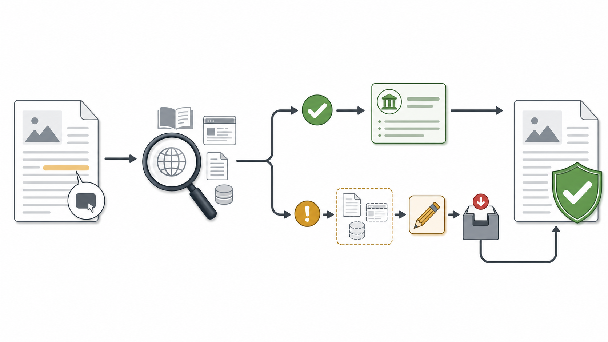

# Future of Writing: From Tools to Specification-Driven Authoring

AI-assisted writing is not the end of authorship. It is the next interface problem. Writers need workflows that let them use AI without surrendering judgment, voice, or responsibility.



*Figure 1. The path from physical writing tools to agentic writing assistants is an evolution of interfaces, not a single rupture. Source: author-created AI-assisted illustration.*

## Part 1: AI Writing Is Part of a Longer History

When people say that using AI for writing is cheating, I understand the reaction. Writing feels intimate. A sentence carries more than information. It carries judgment, rhythm, hesitation, confidence, taste, memory, and sometimes the scars of revision. If a machine enters that process, it is easy to feel that something essential has been taken away.

But the history of writing is also the history of tools entering the process.

Before large language models, before autocomplete, before spellcheckers, before text editors, before computers, there were typewriters. Before typewriters, there were pens and paper. Each tool changed what writing felt like and what writers could do. The typewriter turned handwriting into machine-produced characters and became part of a much larger shift in office and document work [1]. Word processing later changed the surface of writing again: text could be edited, moved, deleted, copied, searched, formatted, saved, and revised in ways that were impossible or painful on paper [2].

Then writing assistance became part of the software itself. Spellcheckers and grammar checkers made correction a normal feature of the writing surface [3]. AutoCorrect went further by changing text while the writer was still typing [4]. It is fair to understand these tools as part of the broader language-modeling tradition. Even when a particular implementation uses dictionaries, rules, or typo tables, the task can still be framed as modeling which words or sentences are likely and which corrections are plausible. Russell and Norvig place language models inside natural-language processing, and Jurafsky and Martin describe n-gram language models as a foundational way to estimate likely word sequences [5], [6]. These tools did not remove the writer. They changed the writer's environment.

Large language models are different in scale and behavior, but they are not the first language models to enter writing. What changed with systems such as GPT-3 was not the basic idea that language can be modeled. What changed was scale, generality, and interface: a model could now respond to natural-language instructions and examples across many tasks [7].

That is why I do not see AI-assisted writing as a sudden moral rupture. I see it as a new stage in a long movement from physical writing tools to software writing tools, from software writing tools to language-aware writing tools, and from language-aware tools to agentic assistants that can participate in planning, drafting, checking, and revising.

This connects to an even older goal in computing: communicating with computers in a way that feels closer to communication with another person. In 1960, J. C. R. Licklider described "man-computer symbiosis" as a cooperative relationship in which humans would set goals and criteria while computers performed routine work needed to prepare for insight and decision [8]. That idea sounds surprisingly modern. In good AI-assisted writing, the writer sets the purpose, audience, thesis, sources, constraints, and quality standard. The machine helps organize, draft, compare, check, and revise.

But here is the danger: a computer that accepts natural language is still not human.

Engineers know this from long experience. They have spent decades communicating with computers through formal languages, commands, APIs, schemas, tests, and version-control systems. Natural language makes some of that power easier to reach, but it can also make the machine feel more understanding than it is. For non-engineers, this can be both liberating and confusing. The interaction looks like conversation, but the system does not share human responsibility, context, or intent.

That is why the future of writing cannot be simply "ask AI to write." That is too loose. It gives the model too much room to invent the article's purpose, choose the argument, smooth over weak claims, and sound confident where the writer has not yet decided.

Nor do I think the answer is to treat every suspicious sentence as evidence of guilt. OpenAI itself discontinued its AI text classifier in 2023 because of low accuracy, and the original announcement warned that AI-written text cannot always be reliably detected [9]. In a recent video, Max Kotin makes a similar public argument from a writer's perspective: the text should be judged by its quality, not by a witch hunt around whether AI was used [10].

I agree with that direction. The question that matters most is not whether a tool was used. Writers have always used tools. The better question is whether the writer remains responsible for the text.

My answer is Specification-Driven Authoring.



*Figure 2. Specification-Driven Authoring turns AI writing into a reviewable loop: define intent first, draft second, revise against the specification. Source: author-created AI-assisted illustration.*

## Part 2: What Specification-Driven Authoring Means

Specification-Driven Authoring, or SDA, is a writing process in which the writer and AI first create a specification for the article before generating the article itself.

That sounds simple, but it changes the relationship between writer and assistant. A prompt asks for output. A specification defines the conditions under which the output can be judged.

In ordinary prompting, the writer might say:

```text
Write an article about the future of writing with AI.
```

The model can produce something plausible from that. It may even produce something polished. But it has to guess the audience, structure, argument, level of detail, sources, tone, and boundaries.

In SDA, the writer and AI first build a shared document that answers questions such as:

- Who is this article for?
- What problem is it trying to solve?
- What is the central claim?
- What should the article not claim?
- What sources are required?
- Which claims are facts, interpretations, or original proposals?
- What figures are needed?
- What tone should the article use?
- What workflow should the AI follow?
- What counts as done?

Only after that specification is mature does the writer approve it for article production.

The lifecycle is:

```text
idea -> specification -> approval -> outline -> draft -> review -> revision -> final article
```

The most important word is approval. The writer does not hand the article to the machine and hope for the best. The writer defines the standard first.

### The Specification Is the Source of Truth

In SDA, the specification is the contract between human intent and AI output.

It does not need to be complicated. A useful article specification can include:

- **Purpose:** why the article exists.
- **Target reader:** who should benefit from it.
- **Core thesis:** the main argument.
- **Article balance:** how much space each part should receive.
- **Voice:** personal essay, practical guide, technical tutorial, or another mode.
- **Claims:** what the article wants to say.
- **Evidence rules:** which claims need external sources.
- **Open questions:** what is still unresolved.
- **Image plan:** what each figure should explain.
- **Publishing constraints:** publication guidelines, style requirements, and reference format.
- **Workflow rules:** how the AI should ask questions, edit files, save versions, and produce drafts.

This matters because prose can become convincing too early. A fluent paragraph can make an unfinished idea feel finished. A specification slows the process down at the point where slowness is useful: before the first full draft.



*Figure 4. The specification translates author intent into criteria the AI draft can be judged against. Source: author-created AI-assisted illustration.*

### The AI Has Roles, but the Writer Keeps Authority

In SDA, the AI can do many useful things:

- It can interview the writer.
- It can find missing assumptions.
- It can propose a structure.
- It can identify unsupported claims.
- It can build a source register.
- It can draft sections from the approved plan.
- It can review the draft against the specification.
- It can prepare image prompts.
- It can help manage versions.

But these are supporting roles. The writer remains the author.

The writer decides what belongs in the specification. The writer approves changes. The writer accepts or rejects the draft. The writer is accountable for the final article.


*Figure 3. In SDA, the human remains author and decision-maker while the AI performs supporting roles. Source: author-created AI-assisted illustration.*

This is also why SDA is different from ghostwriting. The AI is not secretly replacing the author. The process is visible, structured, and reviewable. The writer's intent is recorded before the article exists.

### SDA Separates Types of Claims

One of the biggest risks of AI writing is unsupported confidence.

A model can produce a sentence that sounds true even when the evidence is weak, missing, outdated, or invented. SDA reduces that risk by separating claims into categories:

- **Sourced fact:** a claim supported by an external reference.
- **Author interpretation:** the writer's reading of facts or trends.
- **Workflow experience:** something learned during this project.
- **Original proposal:** a new idea the author is putting forward.
- **Unsupported claim:** a claim that should be sourced, reframed, or removed.

This distinction is important. Not every sentence needs the same kind of evidence. "VS Code has built-in Git support" should be sourced from VS Code documentation [13]. "Writers need gentler language for version control" can be framed as this author's argument. "SDA is a proposed workflow" can be presented as an original proposal and then demonstrated through the project repository.

The point is not to eliminate original thought. The point is to stop factual claims, interpretations, and inventions from wearing the same costume.

SDA also helps with publication rules without making the article feel tied to one journal. A specification can store the target publication's requirements, such as reference style, image captions, alt text, originality rules, and draft format, before drafting starts. Those requirements become part of the article process rather than a final scramble.

### SDA Has Several Flows

From one angle, SDA is a conversation flow:

```text
AI asks -> writer answers -> AI proposes -> writer approves -> AI edits
```

From another angle, it is a production flow:

```text
specification -> research plan -> sources -> outline -> draft -> review -> revision -> final
```

From a third angle, it is a control flow:

```text
human intent -> explicit specification -> reviewable AI work -> human approval
```

From a fourth angle, it is a safety flow:

```text
claim -> source check -> citation or reframe -> version save -> final review
```

These flows are useful because different problems appear at different moments.

If the article feels vague, return to the specification. If the AI changes something without approval, compare versions. If a claim has no source, reframe it as interpretation or remove it. If the draft is polished but wrong, review it against the specification. If the writer is afraid of losing a good version, save a version before experimenting.

SDA is not meant to make writing mechanical. It is meant to make collaboration with AI legible.

## Part 3: A Practical Setup for Writers

There should be a dedicated writing application that does all of this out of the box.

A non-developer writer should not have to assemble a coding editor, an AI agent, Markdown files, Git, GitHub, image prompts, and citation tracking just to write an article with discipline. The need for such an application is one of the conclusions of this project.

But until that application exists, we can borrow the developer workflow and translate it into writer language.

The setup I am using is:

- VS Code as the editor.
- Codex as the AI agent beside the files.
- Markdown as the writing format.
- Git as local version history.
- GitHub as backup and, when appropriate, public transparency.

This is not the only possible setup. Future articles will explore other variants. For now, it is a practical path that you can use today.



*Figure 6. The setup is technical, but the daily workflow should feel editorial: specify, approve, draft, review, revise, and save. Source: author-created AI-assisted illustration.*

### Part 3A: Set Up the Workspace on Windows

This tutorial gives one concrete Windows path for non-developer writers. Future articles can cover variants: macOS, WSL, Codex CLI [16], GitHub CLI, private repositories, and purpose-built writing applications. For now, assume Windows, VS Code, the Codex extension, Windows File Explorer, a GitHub account, and one reusable SDA workflow file.

The reader should not need to understand PowerShell, terminal commands, or Git syntax. The setup below uses ordinary Windows actions first. Codex will handle the Git side later, after the writing folder exists.

#### 1. Install VS Code

Download VS Code from the official download page:

```text
https://code.visualstudio.com/download
```

Choose the Windows **User Installer** unless you have a reason to install for every user on the machine. Microsoft recommends the user setup for most people because it does not require administrator permissions and supports smoother background updates [14].

Run the installer and accept the normal defaults. When it finishes, open VS Code from the Windows Start menu.

#### 2. Install Codex from the VS Code Extensions Button

In VS Code, install Codex from the Extensions view. Microsoft documents that VS Code extensions can be installed directly from the Extensions view, opened from the Activity Bar or with `Ctrl+Shift+X` on Windows [21].

1. In VS Code, click the **Extensions** button on the left side.
2. Search for `Codex`.
3. Select **Codex - OpenAI's coding agent** by OpenAI.
4. Click **Install**.
5. Open the Codex sidebar.
6. Click **Sign in with ChatGPT** and finish the browser sign-in.

OpenAI's Codex IDE documentation describes using Codex beside open files and reviewing changes in the editor [15]. The VS Code Marketplace page describes the extension as a Codex panel that can use context from open files and selected code [19]. For this writing workflow, that means Codex can read the specification, propose edits, create files, and let the writer review changes in place.



*Figure 8. Install Codex from the VS Code Extensions view. Source: author-created instructional screenshot-style figure.*

#### 3. Create a GitHub Account

Open a browser and go to:

```text
https://github.com/signup
```

Create a free personal account and verify your email address. GitHub's own account-creation documentation says that a verified email address is needed for basic GitHub tasks such as creating a repository [22].

For this tutorial, the writer does not need to understand repositories yet. The simple idea is this: GitHub will be the backup location. Later, when Codex sets up versioning, it can guide the writer through creating or connecting the repository.



*Figure 9. Create a GitHub account first, then let Codex help connect the writing folder later. Source: author-created instructional screenshot-style figure.*

#### 4. Create the Writing Folders in Windows Explorer

Now use Windows File Explorer, not a terminal.

1. Open **File Explorer**.
2. Open **Documents**.
3. Create a new folder named `Writing`.
4. Open the `Writing` folder.
5. Create a folder for the first article, for example `Future of writing`.
6. Open `Future of writing`.
7. Create a folder named `Images`.

The folder structure should begin like this:

```text
Documents/
`-- Writing/
    `-- Future of writing/
        `-- Images/
```



*Figure 10. Create the writing folders in Windows File Explorer before asking Codex to configure the project. Source: author-created instructional screenshot-style figure.*

#### 5. Add the SDA Skill File

Before asking Codex to set up the project, put the reusable SDA workflow file into the root `Writing` folder.

This article's project repository contains the reusable file [17]. Open:

```text
https://github.com/erobpen/Writing
```

Find `SDA_SKILL.md`. Save or copy it into the `Writing` folder, beside the `Future of writing` folder.

One simple way is to open `SDA_SKILL.md` on GitHub, copy its full text, create a new file named `SDA_SKILL.md` in the `Writing` folder, paste the text, and save it. The exact method matters less than the result: the file must be named `SDA_SKILL.md`, and it must sit directly inside `Writing`.

The folder should now look like this:

```text
Documents/
`-- Writing/
    |-- SDA_SKILL.md
    `-- Future of writing/
        `-- Images/
```

This is important. `SDA_SKILL.md` tells Codex how to work: ask one focused question, update the specification first, save versions, verify sources, prepare images, and keep the writer in control.

#### 6. Open the Writing Folder in VS Code

Now return to VS Code.

1. Select **File > Open Folder**.
2. Choose the `Writing` folder in Documents.
3. Click **Select Folder**.

VS Code should show `SDA_SKILL.md` and the `Future of writing` folder in the file explorer on the left.

Inside VS Code, create the first specification file:

1. In the left file explorer, right-click `Future of writing`.
2. Select **New File**.
3. Name the file `00_SPEC.md`.

The folder now looks like this:

```text
Documents/
`-- Writing/
    |-- SDA_SKILL.md
    `-- Future of writing/
        |-- 00_SPEC.md
        `-- Images/
```

#### 7. Give Codex the Setup Prompt

At this point, the writer has done the Windows tasks. Now Codex can do the technical setup.

Open the Codex sidebar and paste this prompt:

```text
Read SDA_SKILL.md and the article folder "Future of writing".

I am a writer, not a developer.
Please set up this Writing folder for Specification-Driven Authoring.

First, check that "Future of writing/00_SPEC.md" exists.
If it does not exist, create it.

Then set up Git versioning for this Writing folder.
Use writer-friendly language:
- Save Version = create a local Git checkpoint
- Compare Versions = show what changed
- Restore Previous Version = recover an older checkpoint, but only after asking me
- Publish Backup to GitHub = push a saved version to GitHub

If Git is missing, explain what is missing and ask me before installing or changing anything.
If GitHub setup requires a repository or login, guide me step by step in the browser.

Do not draft the article yet.
After setup, ask me one focused question to start the specification.
```

This prompt tells Codex to do the work that writers should not have to learn first: local version history, GitHub backup, and the translation between Git commands and writer-friendly commands. Git is still the engine underneath, and GitHub still stores repositories and revision history [11], [12]. If Codex later asks to connect the folder to a GitHub repository, it is applying the remote-repository workflow GitHub documents for connecting local work to GitHub [20]. But the writer interacts with those tools through the four writing actions.

If Codex says Git is missing, let Codex guide the next step. If a manual download is needed, use the official Git for Windows page [18]. If Codex asks permission for a technical action, read the explanation. If the action matches this setup goal, approve it. If unsure, ask Codex to explain it in plain language first.



*Figure 11. After the folders and `SDA_SKILL.md` exist, paste the setup prompt into Codex and let the agent handle the Git side. Source: author-created instructional screenshot-style figure.*

#### 8. What Success Looks Like

When setup is complete, the writer should be able to use ordinary commands in conversation with Codex:

- **Save Version** after important progress.
- **Compare Versions** before accepting a large change.
- **Restore Previous Version** when an experiment goes wrong.
- **Publish Backup to GitHub** when the work should be backed up outside the computer.

Later, after the specification is approved, the article folder can grow into:

```text
Future of writing/
|-- 00_SPEC.md
|-- 01_RESEARCH_PLAN.md
|-- 02_SOURCES.md
|-- 03_OUTLINE.md
|-- 04_DRAFT.md
|-- 05_IMAGE_PROMPTS.md
|-- 06_EDITORIAL_REVIEW.md
|-- 07_REVISION_PLAN.md
|-- 08_FINAL.md
`-- Images/
```

The root `SDA_SKILL.md` defines the reusable process. Each article folder has its own `00_SPEC.md`. The `00_` prefix is not magic. It simply keeps the specification first in the folder, where both writer and AI can find it.

This article's project repository is public so readers can go deeper into the specification and article-production files [17]. I also plan to preserve the project chat as Markdown, so the process can be studied rather than hidden.

### Part 3B: Use the SDA Workflow

Once the setup exists, the daily workflow is not technical. It is editorial.

Open the article folder in VS Code. Ask Codex to read the reusable SDA workflow and the article specification. Then follow this loop:

```text
read specification -> ask one question -> writer answers -> propose edit -> writer approves -> edit specification -> Save Version
```

The "one question" rule matters. If the AI asks ten questions at once, the writer has to become a project manager. SDA works better when the assistant identifies the single most important unresolved issue and asks about that.

The writer answers in natural language. The AI then proposes the exact change to the specification. The writer approves, rejects, or revises the proposal. Only after approval does the AI edit the file.

Repeat this until the specification is strong enough.

Then the writer explicitly approves the specification for article production. At that point, the AI can create:

- a research plan;
- a source register;
- an outline;
- a draft;
- image prompts;
- an editorial review;
- a revision plan;
- a final article.

This is the practical difference between SDA and one-shot prompting. The AI is not asked to invent everything from a vague instruction. It is asked to execute a documented authorial plan.

#### Use Writer-Friendly Versioning

Developers say "commit," "diff," "restore," and "push." Those words are useful, but they are not necessary for writers.

Writers can use clearer commands:

**Save Version** means create a local checkpoint. Use it after important decisions, specification changes, drafts, reviews, and final revisions.

**Compare Versions** means inspect what changed. This is how the writer checks whether the AI changed only what was approved.

**Restore Previous Version** means recover an earlier checkpoint. This should require explicit confirmation because it can replace current work.

**Publish Backup to GitHub** means push saved work to the remote repository. It is the difference between "saved on this machine" and "backed up outside this machine."



*Figure 5. Writers do not need to think in Git commands; they need safe writing actions. Source: author-created AI-assisted illustration.*

This translation matters because the goal is not to turn every writer into a developer. The goal is to democratize the part of agentic AI that developers already benefit from: structured files, iterative changes, reviewable edits, source control, and recoverable versions.

#### Verify Claims Before Publication

Source verification should be part of the workflow, not an afterthought.

For each substantive claim, ask:

- Is this a factual claim?
- Is there an external source?
- Is the source credible?
- Does the source actually support the sentence?
- If no source exists, should this be framed as my interpretation, my experience, or my original proposal?

If no source is found, that does not automatically mean the idea is wrong. The world is a large place, but sometimes a writer may be first to name a process in a particular way. In that case, the article should say so honestly. Original ideas are allowed. Unsupported factual certainty is the problem.



*Figure 7. SDA separates sourced fact, author interpretation, and unsupported claims before publication. Source: author-created AI-assisted illustration.*

The same applies to images. If images are generated, they should be stored one image per file in the article's `Images/` folder. Captions, source notes, and alt text should be prepared before publication. This follows the same principle as the rest of SDA: make the hidden process visible enough to review.

#### Review Against the Specification

After the draft exists, do not only ask, "Is this good?"

Ask:

- Does the draft follow the approved structure?
- Does the opening speak to the target reader?
- Does the theory section explain SDA clearly enough?
- Does the tutorial refer back to the theory?
- Are claims properly sourced?
- Are images planned and named?
- Does the conclusion point toward future variants and the need for a dedicated application?

The specification becomes the ruler. The draft is measured against it.

That is the core discipline of SDA.

## What This Changes

The usual fear is that AI will replace the writer. SDA points in another direction.

It treats AI as a powerful assistant, but it also gives the writer a structure:

- a specification before the draft;
- approval before major changes;
- sources before factual confidence;
- images planned with purpose;
- review against the original intent;
- version history for safety.

This structure is especially important for non-engineers. Engineers already live inside structured communication with computers. They use commands, formats, repositories, tests, and review processes. Natural language makes computers easier to approach, but it can also make the workflow feel less bounded than it should be.

SDA adds the boundary back.

It says: yes, talk to the AI in natural language. But do not let the conversation dissolve authorial responsibility. Put the decisions in a specification. Make the AI propose changes. Approve them. Save versions. Check sources. Review the draft against the intent.

That is not cheating. That is a writing process.

## Conclusion

The future of writing is not just better autocomplete. It is not just chatbots in the margin. It is the gradual transformation of writing into collaboration between human intention and machine assistance.

But that collaboration needs discipline.

If writers simply ask for drafts, they risk getting fluent prose without enough authorship. If they reject all AI assistance, they may miss a tool that can help them think, organize, verify, and revise. Specification-Driven Authoring is one attempt to find the middle path.

This article presents my current practical version: VS Code, Codex, Git, GitHub, Markdown, and a specification-first workflow. It is not the final answer. Future articles can explore different setups, different tools, and the deeper question of what it means to communicate with computers in natural language.

The long-term need is clear: writers should have an application built for this. It should include SDA, AI collaboration, source tracking, image handling, version history, review, and publishing support out of the box.

Until then, we can borrow the developer workflow and make it humane for writers.

## References

[1] S. R. Murray, "The Development of the Automatic Writing Machine: The Typewriter," Encyclopedia.com. https://www.encyclopedia.com/science/encyclopedias-almanacs-transcripts-and-maps/development-automatic-writing-machine-typewriter

[2] Computer History Museum, "Software and Languages," Timeline of Computer History. https://www.computerhistory.org/timeline/software-languages/

[3] Microsoft Support, "Check spelling and grammar in Office." https://support.microsoft.com/en-us/office/check-spelling-and-grammar-in-office

[4] Microsoft Support, "Add or remove AutoCorrect entries in Word." https://support.microsoft.com/en-US/Word/add-or-remove-autocorrect-entries-in-word

[5] S. Russell and P. Norvig, Artificial Intelligence: A Modern Approach, 4th ed. Pearson, 2020. https://aima.cs.berkeley.edu/

[6] D. Jurafsky and J. H. Martin, Speech and Language Processing, 3rd ed. draft. https://web.stanford.edu/~jurafsky/slp3/

[7] T. B. Brown et al., "Language Models are Few-Shot Learners," arXiv:2005.14165, 2020. https://arxiv.org/abs/2005.14165

[8] J. C. R. Licklider, "Man-Computer Symbiosis," IRE Transactions on Human Factors in Electronics, vol. HFE-1, pp. 4-11, March 1960. https://groups.csail.mit.edu/medg/people/psz/Licklider

[9] OpenAI, "New AI classifier for indicating AI-written text," Jan. 31, 2023. https://openai.com/index/new-ai-classifier-for-indicating-ai-written-text/

[10] M. Kotin, "Nobody Can Spot AI in Writing, Actually," YouTube, published July 17, 2026. https://youtu.be/tze93ItrA9k?is=_uXCf1vGT5lslqgR

[11] S. Chacon and B. Straub, Pro Git, "About Version Control." https://git-scm.com/book/en/v2/Getting-Started-About-Version-Control

[12] GitHub Docs, "About repositories." https://docs.github.com/en/repositories/creating-and-managing-repositories/about-repositories

[13] Microsoft, "Source Control in VS Code." https://code.visualstudio.com/docs/sourcecontrol/overview

[14] Microsoft, "Installing Visual Studio Code on Windows." https://code.visualstudio.com/docs/setup/windows

[15] OpenAI, "Codex IDE extension," ChatGPT Learn. https://learn.chatgpt.com/docs/codex/ide

[16] OpenAI, "Codex CLI," ChatGPT Learn. https://learn.chatgpt.com/docs/codex/cli

[17] R. Penco, "Writing" project repository. https://github.com/erobpen/Writing

[18] Git, "Install for Windows." https://git-scm.com/downloads/win

[19] Visual Studio Marketplace, "Codex - OpenAI's coding agent." https://marketplace.visualstudio.com/items?itemName=OpenAI.chatgpt

[20] GitHub Docs, "Managing remote repositories." https://docs.github.com/en/get-started/git-basics/managing-remote-repositories

[21] Microsoft, "Extension Marketplace," Visual Studio Code Docs. https://code.visualstudio.com/docs/configure/extensions/extension-marketplace

[22] GitHub Docs, "Creating an account on GitHub." https://docs.github.com/en/get-started/start-your-journey/creating-an-account-on-github
